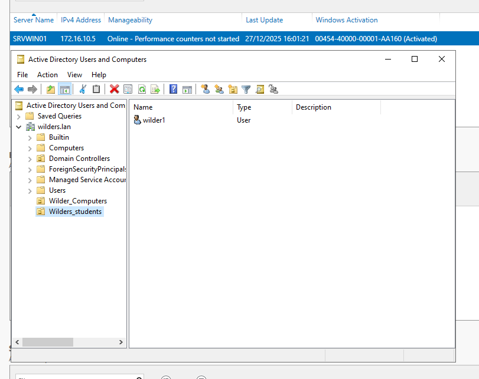
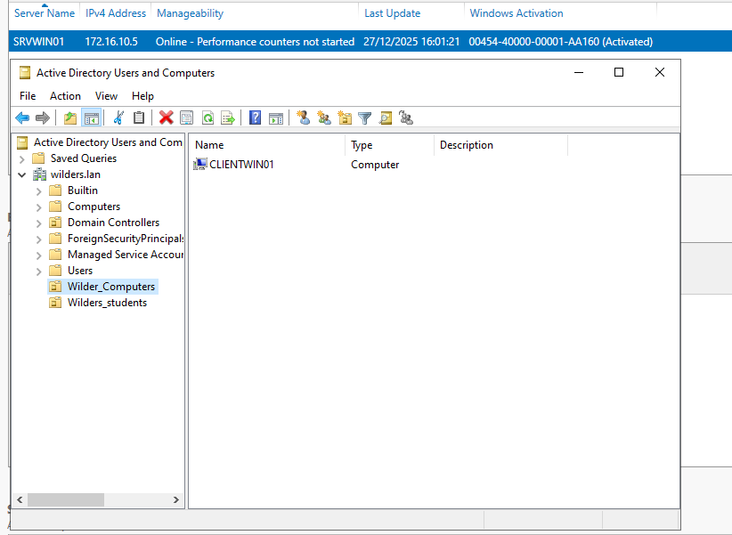
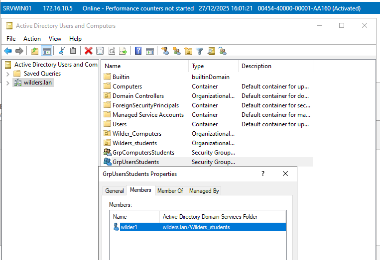
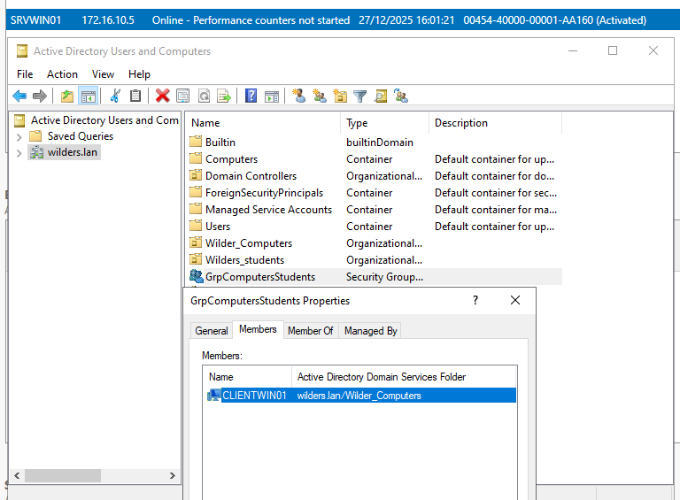
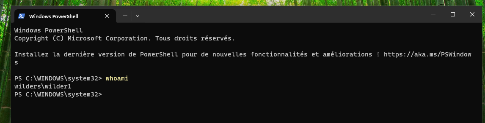

# AD_les_OU

## OU utilisateur

La capture d’écran montre le compte wilder1  qui est dans le **OU Wilders_students **:

## OU ordinateur

La capture d'écran montre que le CLIENTWIN01 qui est dans le **OU Wilder_Computers**

## Groupe Utilisateur

La capture d'écran montre que wilder1 fait partie du groupe **GRPUsersStudents **:

## Groupe Ordinateur

La capture d'écran montre que le CLIENTWIN01 fait partie du groupe **GrpComputersStudents**

## Commande sur PC client WHOAMI

La capture montre le résultat de la commande **whoami** sur le pc client CLIENTWIN01

